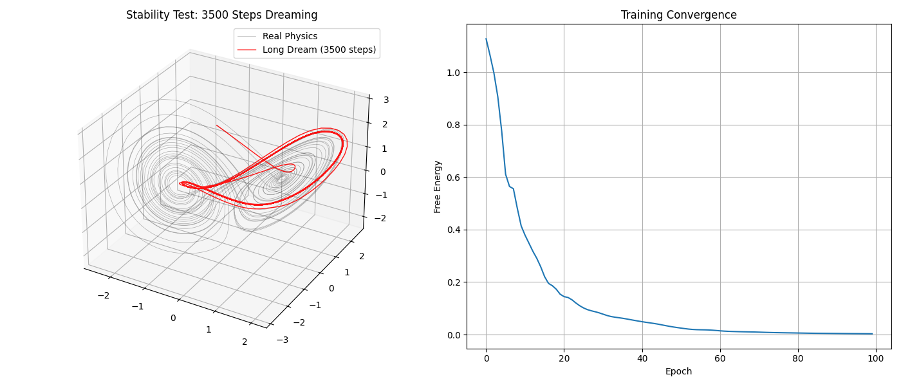

# Gita : Self-Models (V2 - V3)

an experimental deep learning architecture built with PyTorch. This project explores the intersection of neural networks and cognitive science, drawing heavy inspiration from the **Free Energy Principle** and **Active Inference**. 

Unlike standard sequence models that merely map inputs to outputs, this project aims to create "organisms" computational entities designed to build, understand, and predict their own internal states alongside the external world.

## Core Philosophy & Grand Vision

The long-term goal of the Self-Models project is to transcend traditional data-processing algorithms by anchoring the architecture in three major philosophical pillars:

1. **Persistent Internal State (Time-Based "Inner World"):** 
   The model does not just reset at every epoch. It aims to possess a continuously running internal state a persistent "inner world" that evolves linearly with time, independent of external stimuli.
2. **Meta-Cognition:** 
   The ability to observe one's own feelings and states. The network allocates computational power not only to solve external tasks but to "look inward" and predict its own future cognitive states.
3. **Dynamic Homeostasis (DNA-Driven Metabolism):** 
   Moving away from static hyperparameters, the organism's "metabolism" (how it balances external learning vs. internal dreaming) will dynamically adapt based on foundational intrinsic rules, akin to biological DNA.

> **Note:** These three concepts represent the ultimate vision of the project. The current technical iterations (**V2** and **V3**) are the foundational stepping stones toward realizing these mechanics. 

## Architecture Anatomy

The "brain" of the organism is modularly divided into four specialized components:

* **The Observer (`SelfEncoder`):** Compresses short-term memory (hidden states) into a stable latent representation known as the "self-concept." It utilizes bounded activations (Tanh) to maintain attractor stability.
* **The Oracle (`SelfPredictor`):** The imagination center. It predicts how the self-concept will change in the next time step using residual connections, preventing the model from "forgetting" its current identity.
* **The Actor (`ActionDecoder`):** Translates internal latent representations into physical, external actions or predictions (output logits).
* **The Core (`RecursiveCore`):** The primary memory engine (LSTM-based) that processes both external sensory inputs and internal self-concepts. In autonomous modes, it is also capable of processing "surprise" signals (prediction errors).

## Training Mechanism: Dual Loss (Free Energy)

The organism is trained by minimizing a proxy for Total Free Energy, utilizing a Dual Loss mechanism:

* **Task Loss:** The error in interacting with or predicting the external physical world.
* **Dream / Self-Modeling Loss:** The internal error calculated by comparing the Oracle's prediction of the self with the Observer's actual perception of the self in the future.

## Experimental Results: Chaos & The Lorenz Attractor

To push the limits of the organism's stability and its capacity for a persistent internal state, the model is tested against the **Lorenz Attractor**, a highly chaotic and initial-condition-sensitive dynamical system.

After training, the organism is forced into a **"Closed-Loop Dreaming"** phase. Given only a single starting coordinate, the model cuts off all external sensory input and hallucinates thousands of steps into the future purely autoregressively.

### Reality vs. Dream (3D Stability Test)
*The following chart demonstrates the model's hallucination (red) successfully wrapping around the actual physics of the chaotic system (black) over an extended period.*

